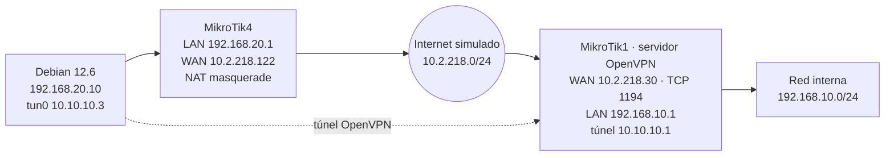

# VPN OpenVPN entre MikroTik CHR y Debian (GNS3)

Práctica del **Curso de Especialización en Ciberseguridad** · IES Enric Valor · febrero 2026
Autor: **Carlos Aparici Pérez**

Conexión VPN con **OpenVPN** entre un cliente **Debian 12.6** y un servidor **MikroTik CHR 7.16**, atravesando un Internet simulado en **GNS3**. Autenticación por usuario y contraseña, verificando el certificado del servidor por *fingerprint* en lugar de desplegar una PKI completa en el cliente.

## Topología



| Dispositivo | Interfaz | IP | Rol |
|---|---|---|---|
| MikroTik CHR 7.16-1 | ether1 | 10.2.218.30/24 | Servidor VPN / gateway WAN |
| MikroTik CHR 7.16-1 | ether2 | 192.168.10.1/24 | Gateway LAN interna |
| MikroTik CHR 7.16-4 | ether1 | 10.2.218.122/24 | Gateway WAN del cliente |
| MikroTik CHR 7.16-4 | ether2 | 192.168.20.1/24 | Gateway LAN del Debian |
| Debian 12.6 | ens4 | 192.168.20.10/24 | Cliente VPN |
| Debian 12.6 | tun0 | 10.10.10.3/24 | IP dentro del túnel |

## Pasos

1. **Red del cliente:** IP estática en `/etc/network/interfaces` (sin NetworkManager) → [`debian/interfaces`](debian/interfaces)
2. **NAT en el router del cliente:** regla `masquerade` en MikroTik4 → [`mikrotik/mikrotik4-nat.rsc`](mikrotik/mikrotik4-nat.rsc)
3. **Revisión del servidor OpenVPN** en MikroTik1 → [`mikrotik/mikrotik1-verificacion.rsc`](mikrotik/mikrotik1-verificacion.rsc)
4. **Repositorios de Debian** corregidos e instalación de `openvpn` → [`debian/sources.list`](debian/sources.list)
5. **Cliente OpenVPN** con verificación del servidor por fingerprint → [`debian/client.conf`](debian/client.conf)

```bash
sudo openvpn --config /etc/openvpn/client.conf
# ... Initialization Sequence Completed
ping 10.10.10.1      # extremo del túnel en MikroTik1
ping 192.168.10.1    # red interna detrás del servidor
```

## Resultado

| Parámetro | Valor |
|---|---|
| IP del túnel (cliente / servidor) | 10.10.10.3 / 10.10.10.1 |
| Transporte | TCP 1194 |
| TLS | TLSv1.2 (ECDHE-RSA-AES256-GCM-SHA384) |
| Cifrado de datos / auth | AES-128-CBC / SHA256 |
| Keepalive | ping 20 s / restart 60 s |

## Incidencias y resolución

| Incidencia | Causa | Solución |
|---|---|---|
| Debian sin IP | Interfaz `ens4` sin configurar | IP estática en `/etc/network/interfaces` |
| Sin acceso a Internet desde Debian | Faltaba NAT en MikroTik4: los paquetes salían sin enmascarar | `masquerade` en `srcnat` por `ether1` |
| `apt` no encuentra `openvpn` | `sources.list` vacío o incorrecto | Repositorios oficiales de Debian 12 Bookworm |
| `Error: must define CA file` | OpenVPN 2.6 exige verificar el servidor | `peer-fingerprint` en lugar de CA |
| `format error in hash fingerprint` | Fingerprint sin separadores `:` | Conversión con `sed 's/../&:/g;s/:$//'` |

## Conclusiones

- El NAT en los routers intermedios es imprescindible para que una red privada salga a Internet.
- Hacer compatibles OpenVPN 2.6 (Debian) y el servidor de MikroTik exigió ajustar el formato del fingerprint y los parámetros de cifrado.
- MikroTik solo admite OpenVPN sobre TCP, con cierta penalización frente a UDP. Como mejora, migraría a **WireGuard**, soportado de forma nativa en RouterOS 7 y Debian 12.

> Las credenciales y el fingerprint real se han sustituido por marcadores. El fichero de credenciales real se guarda con permisos `600` y nunca se sube al repositorio.

## Tecnologías

`MikroTik RouterOS 7` `OpenVPN` `Debian 12` `GNS3` `NAT` `TLS`
